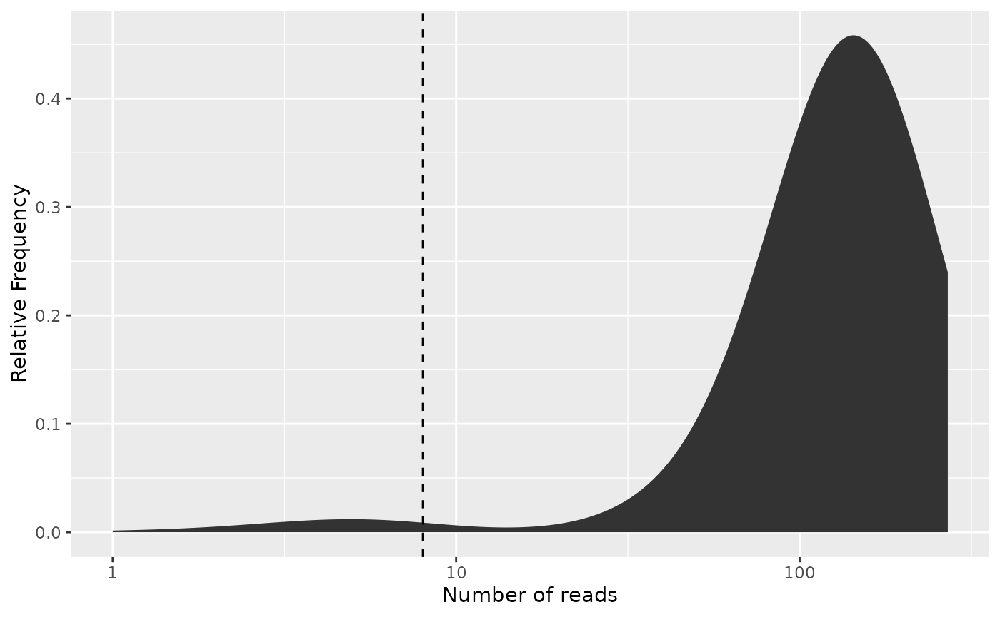

# Introduction to combinatorial demultiplexing

## Basics

### When and why to use this package

This package is aimed at single-cell RNA-seq approaches such as
SPLiT-seq \[[1](https://www.science.org/doi/10.1126/science.aam8999);
[2](https://doi.org/10.1186/s12864-024-10285-3)\], BacDrop
\[[3](https://www.sciencedirect.com/science/article/pii/S0092867423000028)\],
and PETRI-seq \[[4](https://www.nature.com/articles/s41564-020-0729-6);
[5](https://www.nature.com/articles/s41586-024-08124-2)\]. Here, each
cell to be sequenced is defined by its own unique combination of
multiple DNA barcodes. We do assume that the individual barcodes come
from a predefined whitelist, but that the combination of barcodes is
random and that every possible combination of barcodes is valid. In
order to identify from which cell each read is coming from, we must
extract the barcodes, compare them with the reference barcodes, and find
the best match.

### Required knowledge

*[posDemux](https://bioconductor.org/packages/3.23/posDemux)* uses the
*[Biostrings](https://bioconductor.org/packages/3.23/Biostrings)*
package for handling sequencing data and hence a basic understanding of
`Biostrings` is necessary to use this package. Also important to note is
the fact that while `posDemux` does provide utilities for demultiplexing
scRNA-seq data, it is designed to be part of a greater workflow. In
particular, the package does not include essential components of a
scRNA-seq workflow like quality control, alignment, feature counting and
UMI deduplication, neither does it provide any utilities for tertiary
analysis once the gene count matrix is constructed. Hence, the user
should be familiar with the other components of such workflows
\[[2](https://doi.org/10.1186/s12864-024-10285-3)\] and know how the
functionality of this package plays a part therein.

If you are asking yourself the question “Where do I start using
Bioconductor?” you might be interested in [this blog
post](https://lcolladotor.github.io/2014/10/16/where-do-i-start-using-bioconductor/).

### Limitations

Since this is a positional demultiplexer, the position of all segments
and barcodes must be known in advance and be the same for all reads.
Hence, the package is not suited in cases where segments occur at
variable positions among the reads. Furthermore, in the cases where the
segments are at fixed positions among the reads, but the segment lengths
are unknown, it may require some trial and error to obtain the correct
segmentation.

The demultiplexer is written with Illumina sequencing in mind. It
assumes that substitution sequencing errors may occur, but has no
safeguard against indel sequencing errors. Hence, indel errors will
result in erroneous segmentation and failure to assign the correct
barcode. For sequencing platforms where indel errors are common, such as
Nanopore sequencing, this package may therefore not be suitable.

This package does not by itself support combining barcodes on both
reverse and forward reads, but this limitation can be circumvented by
either artificially merging reads or manipulating the result structures
from the demultiplexer.

### Ways to interact with this package

This vignette describes the basic usage of the package where the FASTQ
files are read into `R` before the demultiplexing begins. For large
datasets or memory-limited systems, reading all sequences into memory at
once is too taxing. For this reason, `posDemux` has a streaming API
where only parts of the input file is read at a time. For brevity, this
functionality is explained in its own vignette
([`vignette("streaming")`](https://yaccos.github.io/posDemux/articles/streaming.md)).
We believe that most end-users won’t interact with this package
directly, but rather in the form of a custom-made bioinformatic
pipeline. Also, we think that most developers of bioinformatics
pipelines would prefer the streaming API. Still, we think those
developing with this package should have an understanding of its
low-level API as to understand what it does under the hood.

### Install `posDemux`

This package is hosted on [Bioconductor](http://bioconductor.org)
repository for `R` packages. In order to install it from a fresh `R`
install, run:

``` r
if (!requireNamespace("BiocManager", quietly = TRUE)) {
    install.packages("BiocManager")
}

BiocManager::install("posDemux")

## Check that you have a valid Bioconductor installation
BiocManager::valid()
```

If you want to obtain the development version of the package, it is
available on [GitHub](https://github.com/yaccos/posDemux):

``` r
if (!requireNamespace("devtools", quietly = TRUE)) {
    install.packages("devtools")
}

devtools::install("yaccos/posDemux")
```

If you compile the package from source, we do recommend you use the
compiler flag `-ftree-vectorize` as this provides considerable speedup
to the demultiplexer.

### Asking for help

As package developers, we try to explain clearly how to use our packages
and in which order to use the functions. But `R` and `Bioconductor` have
a steep learning curve so it is critical to learn where to ask for help.
The blog post quoted above mentions some but we would like to highlight
the [Bioconductor support site](https://support.bioconductor.org/) as
the main resource for getting help: Remember to use the `posDemux` tag
and check [the older
posts](https://support.bioconductor.org/tag/posDemux/). Other
alternatives are available such as creating GitHub issues and tweeting.
However, please note that if you want to receive help you should adhere
to the [posting
guidelines](http://www.bioconductor.org/help/support/posting-guide/). It
is particularly critical that you provide a small reproducible example
and your session information so package developers can track down the
source of the error.

### Citing `posDemux`

We hope that
*[posDemux](https://bioconductor.org/packages/3.23/posDemux)* will be
useful for your research. Please use the following information to cite
the package and the overall approach. Thank you!

``` r
## Citation info
citation("posDemux")
#> To cite package 'posDemux' in publications use:
#> 
#>   Pettersen J (2025). _posDemux: Positional combinatorial sequence
#>   demultiplexer_. R package version 0.99.9,
#>   <https://github.com/yaccos/posDemux>.
#> 
#> A BibTeX entry for LaTeX users is
#> 
#>   @Manual{,
#>     title = {posDemux: Positional combinatorial sequence demultiplexer},
#>     author = {Jakob Peder Pettersen},
#>     year = {2025},
#>     note = {R package version 0.99.9},
#>     url = {https://github.com/yaccos/posDemux},
#>   }
```

## An example with PETRI-seq

### Quick overview of the method

The PETRI-seq method is a method for single-cell RNA-sequencing of
bacteria \[[4](https://www.nature.com/articles/s41564-020-0729-6);
[5](https://www.nature.com/articles/s41586-024-08124-2)\]. It uses
paired-end Illumina sequencing where the forward read contains the cell
barcodes and the transcript UMI, whereas the reverse read contain the
cDNA to be aligned to the genome. Hence, `posDemux` will only be applied
to the forward reads. We start by loading the `posDemux` itself and some
helper packages:

``` r
library(posDemux)
library(Biostrings)
library(purrr)
library(magrittr)
```

### Sequence annotation

For PETRI-seq, the forward read consists of the following segments in
the following order (from 5’ to 3’):

- UMI: 7 nucletides
- Barcode 3(`bc3`) : 7 nucleotides
- Linker: 15 nucletides
- Barcode 2(`bc2`): 7 nucleotides
- Linker: 14 nucletides
- Barcode 1(`bc1`): 7 nucleotides
- The rest of the read is ignored

Hence, we consider the first segment, the UMI, as a payload (denoted as
`P` in the sequence annotation) to be kept. The three barcodes (denoted
as `B`) are used for demultiplexing. Finally, the linkers and the read
past Barcode 1 (denoted as `A`) are ignored.

We specify it with as:

``` r
sequence_annotation <- c(UMI = "P", "B", "A", "B", "A", "B", "A")
segment_lengths <- c(7L, 7L, 15L, 7L, 14L, 7L, NA_integer_)
```

### Data loading

For the demultiplexing, we need the listing of the barcodes, and of
course the reads to demultiplex. For this package, the PETRI-seq
barcodes and synthetically generated reads are provided. We load the
barcodes:

``` r
barcode_files <- system.file("extdata/PETRI-seq_barcodes",
    c(
        bc1 = "bc1.fa",
        bc2 = "bc2.fa",
        bc3 = "bc3.fa"
    ),
    package = "posDemux"
)
names(barcode_files) <- paste0("bc", 1L:3L)
barcode_index <- map(barcode_files, readDNAStringSet)
```

… and the FASTQ file containing the forward reads:

``` r
input_fastq <- system.file("extdata",
    "PETRI-seq_forward_reads.fq.gz",
    package = "posDemux"
)
reads <- readDNAStringSet(input_fastq, format = "fastq")
```

`posDemux` accepts both `DNAStringSet` and `QualityScaledDNAStringSet`
as input where the latter contain the quality scores of the reads.
However, the quality score is ignored by the demultiplexer and the only
reason to pass a `QualityScaledDNAStringSet` is when it is desirable to
retain the quality scores in the payload.

### Running the demultiplexer

Before we run the demultiplexer, we must ensure that the barcodes index
is arranged in the correct order:

``` r
barcodes <- barcode_index[c("bc3", "bc2", "bc1")]
```

We are now ready to run the demultiplexer:

``` r
demultiplex_res <- combinatorial_demultiplex(
    reads,
    barcodes = barcodes,
    segments = sequence_annotation,
    segment_lengths = segment_lengths
)
```

The main results from this demultiplexer are the table of assigned
barcodes:

``` r
head(demultiplex_res$assigned_barcodes)
#>       bc3      bc2      bc1     
#> seq_1 "bc3_57" "bc2_51" "bc1_94"
#> seq_2 "bc3_72" "bc2_94" "bc1_95"
#> seq_3 "bc3_23" "bc2_37" "bc1_85"
#> seq_4 "bc3_85" "bc2_81" "bc1_17"
#> seq_5 "bc3_49" "bc2_64" "bc1_77"
#> seq_6 "bc3_3"  "bc2_45" "bc1_33"
```

the table of mismatches to the barcode:

``` r
head(demultiplex_res$mismatches)
#>       bc3 bc2 bc1
#> seq_1   0   0   0
#> seq_2   0   0   0
#> seq_3   2   2   2
#> seq_4   0   0   0
#> seq_5   0   0   0
#> seq_6   0   0   0
```

as well as the extracted UMI sequences:

``` r
demultiplex_res$payload$UMI
#> DNAStringSet object of length 56895:
#>         width seq                                           names               
#>     [1]     7 GCCTAAC                                       seq_1
#>     [2]     7 CCAAGCG                                       seq_2
#>     [3]     7 AGTGCAC                                       seq_3
#>     [4]     7 CCTAACG                                       seq_4
#>     [5]     7 GCTCGTC                                       seq_5
#>     ...   ... ...
#> [56891]     7 ACGGCTT                                       seq_56891
#> [56892]     7 ATGAGCG                                       seq_56892
#> [56893]     7 ACCTGCG                                       seq_56893
#> [56894]     7 GGATATC                                       seq_56894
#> [56895]     7 GCCTTGA                                       seq_56895
```

### Error correction

`posDemux` handles two types reads filtering:

- Retaining only the reads being matched with a barcode combination
  after error correction.
- Removing barcode combinations which have few reads as these are
  usually artifacts and are not assumed to cover the transcripts of an
  entire cell.

This subsection consider the first type of filtering. During
demultiplexing,the barcode with the smallest Hamming distance to the
read is chosen and the number of mismatches is recorded. If there are
multiple barcodes being equal in distance to the query, one of these
barcodes is chosen. When there are no mismatches for any of the barcode
sets, we obviously want to keep this read. When one or more barcode has
mismatches, `posDemux` allows for error correction. In that case, we
will keep the read if the number of mismatches to each of its barcodes
is below a certain threshold.

In our example, the smallest Hamming distance between two different
barcodes is $3$ for all barcode sets. Given $n$, the number of barcode
sequencing errors which can be reliably corrected in a barcode set, the
minimum distance required between two distinct barcodes needs to be at
least $2n + 1$. This means that in our case, we can correct for exactly
one sequencing error:

``` r
filtered_res <- filter_demultiplex_res(
    demultiplex_res,
    allowed_mismatches = 1L
)
```

We will now inspect the summary of the demultiplexing and filtering:

``` r
filtered_res$summary_res
#> Total number of reads: 56895 
#> Number of reads failing to demultiplex: 4989 (8.77%) 
#> Observed number of unique barcode combinations:978 
#> Number of possible barcode combinations: 884736 
#> Estimated number of features: 978.5 
#> Observed feature to barcode ratio: 0.001105 
#> Corrected feature to barcode ratio: 0.001106 
#> Estimated number of observed barcode combinations
#> corresponding to more than one feature: 0.5 (0.06%) 
#> Number of barcode sets: 3 
#> - - - - - - - - - - - - - - - - - - - - - - - - - - - - - - - - - - - - - - - - - - - - - - - - - - - - - - - - - - - - - - - - - - - - - - - - - - - - - - - - 
#> Barcode set: bc3 
#> Barcode width: 7 
#> Number of possible barcodes: 96 
#> Number of allowed mismatches: 1 
#> Number of reads with 0 mismatches: 51923 (91.26%) 
#> Number of reads with 1 mismatches: 671 (1.18%) 
#> Number of reads above mismatch threshold: 4301 (7.56%) 
#> - - - - - - - - - - - - - - - - - - - - - - - - - - - - - - - - - - - - - - - - - - - - - - - - - - - - - - - - - - - - - - - - - - - - - - - - - - - - - - - - 
#> Barcode set: bc2 
#> Barcode width: 7 
#> Number of possible barcodes: 96 
#> Number of allowed mismatches: 1 
#> Number of reads with 0 mismatches: 51918 (91.25%) 
#> Number of reads with 1 mismatches: 567 (1%) 
#> Number of reads above mismatch threshold: 4410 (7.75%) 
#> - - - - - - - - - - - - - - - - - - - - - - - - - - - - - - - - - - - - - - - - - - - - - - - - - - - - - - - - - - - - - - - - - - - - - - - - - - - - - - - - 
#> Barcode set: bc1 
#> Barcode width: 7 
#> Number of possible barcodes: 96 
#> Number of allowed mismatches: 1 
#> Number of reads with 0 mismatches: 51930 (91.27%) 
#> Number of reads with 1 mismatches: 642 (1.13%) 
#> Number of reads above mismatch threshold: 4323 (7.6%) 
#> - - - - - - - - - - - - - - - - - - - - - - - - - - - - - - - - - - - - - - - - - - - - - - - - - - - - - - - - - - - - - - - - - - - - - - - - - - - - - - - -
```

Now, the results in `filtered_res$demultiplex_res` only shows the reads
either without mismatches or where error correction could be applied:

``` r
head(filtered_res$demultiplex_res$assigned_barcodes)
#>       bc3      bc2      bc1     
#> seq_1 "bc3_57" "bc2_51" "bc1_94"
#> seq_2 "bc3_72" "bc2_94" "bc1_95"
#> seq_4 "bc3_85" "bc2_81" "bc1_17"
#> seq_5 "bc3_49" "bc2_64" "bc1_77"
#> seq_6 "bc3_3"  "bc2_45" "bc1_33"
#> seq_7 "bc3_17" "bc2_57" "bc1_71"
head(filtered_res$demultiplex_res$mismatches)
#>       bc3 bc2 bc1
#> seq_1   0   0   0
#> seq_2   0   0   0
#> seq_4   0   0   0
#> seq_5   0   0   0
#> seq_6   0   0   0
#> seq_7   0   0   0
```

We can also see which reads are retained:

``` r
head(filtered_res$retained)
#> seq_1 seq_2 seq_3 seq_4 seq_5 seq_6 
#>  TRUE  TRUE FALSE  TRUE  TRUE  TRUE
```

### Filtering by barcode frequency

Now as we have conducted the filtering based on barcode mismatches, we
proceed with the second kind of filtering. It utilizes the Knee method
\[[6](https://www.sciencedirect.com/science/article/pii/S0092867415005498);
[4](https://www.nature.com/articles/s41564-020-0729-6)\] where the
barcode combinations are arranged in descending order on frequency and
the most abundant ones are selected. The cutoff is set such that we
achieve a saturation where most reads are covered, yet the remaining
barcode combinations not covered all have a small number of reads.

We first create a frequency table of the barcodes is question:

``` r
freq_table <- create_freq_table(
    filtered_res$demultiplex_res$assigned_barcodes
)
head(freq_table)
#>      bc3    bc2    bc1 frequency cumulative_frequency    fraction
#> 1 bc3_37  bc2_4 bc1_30       270                  270 0.005201711
#> 2 bc3_45 bc2_36 bc1_65       246                  516 0.004739336
#> 3 bc3_25 bc2_34 bc1_25       235                  751 0.004527415
#> 4 bc3_40 bc2_62 bc1_42       221                  972 0.004257697
#> 5 bc3_69 bc2_95 bc1_37       219                 1191 0.004219165
#> 6 bc3_29 bc2_90 bc1_40       217                 1408 0.004180634
#>   cumulative_fraction
#> 1         0.005201711
#> 2         0.009941047
#> 3         0.014468462
#> 4         0.018726159
#> 5         0.022945324
#> 6         0.027125958
```

This package contains an interaction Shiny application for selecting the
number of barcodes. It can be run by:

``` r
interactive_bc_cutoff(freq_table)
```

If you are working outside RStudio, you may have to run

``` r
app <- interactive_bc_cutoff(freq_table)
shiny::runApp(app, launch.browser = FALSE)
```

and opening the resulting link inside the browser. If you are working on
a headless system, you may consider:

- Using RStudio Server
- Opening a reverse ssh tunnel for the Shiny server
- Copy the frequency table onto your local machine and run the
  application there

If you run the application, you will see that keeping approximately 500
barcodes is the optimal choice[¹](#fn1). We can also calculate the
frequency of the least abundant barcode combination being included.

``` r
bc_cutoff <- 500L
freq_cutoff <- bc_to_freq_cutoff(freq_table, bc_cutoff)
freq_cutoff
#> [1] 8
```

We can convert the cutoff the other way as well, but it is in general
not an exact inverse as multiple barcodes can have the same frequency:

``` r
reconstrued_bc_cutoff <- freq_to_bc_cutoff(
    freq_table,
    freq_cutoff
)
reconstrued_bc_cutoff
#> [1] 505
```

The cutoff can be illustrated by the Knee plot as in the interactive
application:

``` r
knee_plot(freq_table = freq_table, cutoff = bc_cutoff)
```


We can also illustrate this filtering by looking at the distribution of
barcode frequencies:

``` r
# Since the cutoff lines of the plot are provided by the literal x-coordinate,
# we must use the frequency cutoff
freq_plot(freq_table,
    cutoff = freq_cutoff, type = "density",
    log_scale_x = TRUE
)
```


Often the frequency plot gets easier to interpret when we scale the
y-axis by the number of reads, hence creating a mass plot of where the
reads are distributed based on their respective barcodes:

``` r
# Since the cutoff lines of the plot are provided by the literal x-coordinate,
# we must use the frequency cutoff
freq_plot(freq_table,
    cutoff = freq_cutoff, type = "density",
    log_scale_x = TRUE, scale_by_reads = TRUE
)
```



### Exporting results

Now as we know how many barcodes to keep, we can extract the desired
results and write it to a table.

We start with the frequency table. Since it is already sorted in
descending order of frequency, we simply take the top entries in the
table:

``` r
selected_freq_table <- freq_table[seq_len(bc_cutoff), ]
```

For finding which reads correspond to these barcodes, we do the
following:

``` r
assigned_barcodes <- filtered_res$demultiplex_res$assigned_barcodes
read_in_selection <- row_match(assigned_barcodes, selected_freq_table)
selected_assigned_barcodes <- assigned_barcodes[read_in_selection, ]
```

We continue with the UMIs which we convert to a character vector
(remember that the payload and assigned barcodes are aligned in order):

``` r
assigned_UMI <- filtered_res$demultiplex_res$payload$UMI %>% as.character()
selected_assigned_UMI <- assigned_UMI[read_in_selection]
```

With all of this done, we can make a data frame containing the UMI, read
identifier, and barcode assignments:

``` r
res_table <- as.data.frame(selected_assigned_barcodes) %>%
    dplyr::mutate(
        read = rownames(selected_assigned_barcodes),
        UMI = selected_assigned_UMI
    ) %>%
    # Ensures the columns appears in the desired order
    dplyr::select(read, UMI, bc3, bc2, bc1)
head(res_table)
#>        read     UMI    bc3    bc2    bc1
#> seq_1 seq_1 GCCTAAC bc3_57 bc2_51 bc1_94
#> seq_2 seq_2 CCAAGCG bc3_72 bc2_94 bc1_95
#> seq_4 seq_4 CCTAACG bc3_85 bc2_81 bc1_17
#> seq_5 seq_5 GCTCGTC bc3_49 bc2_64 bc1_77
#> seq_6 seq_6 TGGAGAA  bc3_3 bc2_45 bc1_33
#> seq_7 seq_7 ACTTCGA bc3_17 bc2_57 bc1_71
```

Finally, we can write the table to file. The following is the suggested
way for achieving the desired formatting:

``` r
file <- tempfile(pattern = "barcode_table", fileext = ".txt")
write.table(res_table, file,
    row.names = FALSE,
    col.names = TRUE, sep = "\t", eol = "\n", quote = FALSE
)
```

## Reproducibility

The *[posDemux](https://bioconductor.org/packages/3.23/posDemux)*
package  
was made possible thanks to:

- R
- *[BiocStyle](https://bioconductor.org/packages/3.23/BiocStyle)*
- *[knitr](https://CRAN.R-project.org/package=knitr)*
- *[RefManageR](https://CRAN.R-project.org/package=RefManageR)*
- *[rmarkdown](https://CRAN.R-project.org/package=rmarkdown)*
- *[sessioninfo](https://CRAN.R-project.org/package=sessioninfo)*
- *[testthat](https://CRAN.R-project.org/package=testthat)*

This package was developed using
*[biocthis](https://bioconductor.org/packages/3.23/biocthis)*.

`R` session information:

    #> ─ Session info ───────────────────────────────────────────────────────────────────────────────────────────────────────
    #>  setting  value
    #>  version  R Under development (unstable) (2025-12-15 r89175)
    #>  os       Ubuntu 24.04.3 LTS
    #>  system   x86_64, linux-gnu
    #>  ui       X11
    #>  language en
    #>  collate  C.UTF-8
    #>  ctype    C.UTF-8
    #>  tz       UTC
    #>  date     2025-12-17
    #>  pandoc   3.1.11 @ /opt/hostedtoolcache/pandoc/3.1.11/x64/ (via rmarkdown)
    #>  quarto   NA
    #> 
    #> ─ Packages ───────────────────────────────────────────────────────────────────────────────────────────────────────────
    #>  package      * version   date (UTC) lib source
    #>  assertthat     0.2.1     2019-03-21 [1] RSPM
    #>  backports      1.5.0     2024-05-23 [1] RSPM
    #>  bibtex         0.5.1     2023-01-26 [1] RSPM
    #>  BiocGenerics * 0.57.0    2025-10-30 [1] Bioconduc~
    #>  BiocManager    1.30.27   2025-11-14 [1] RSPM
    #>  BiocStyle    * 2.39.0    2025-10-30 [1] Bioconduc~
    #>  Biostrings   * 2.79.2    2025-11-05 [1] Bioconduc~
    #>  bookdown       0.46      2025-12-05 [1] RSPM
    #>  bslib          0.9.0     2025-01-30 [1] RSPM
    #>  cachem         1.1.0     2024-05-16 [1] RSPM
    #>  cli            3.6.5     2025-04-23 [1] RSPM
    #>  crayon         1.5.3     2024-06-20 [1] RSPM
    #>  desc           1.4.3     2023-12-10 [1] RSPM
    #>  digest         0.6.39    2025-11-19 [1] RSPM
    #>  dplyr          1.1.4     2023-11-17 [1] RSPM
    #>  evaluate       1.0.5     2025-08-27 [1] RSPM
    #>  farver         2.1.2     2024-05-13 [1] RSPM
    #>  fastmap        1.2.0     2024-05-15 [1] RSPM
    #>  fs             1.6.6     2025-04-12 [1] RSPM
    #>  generics     * 0.1.4     2025-05-09 [1] RSPM
    #>  ggplot2        4.0.1     2025-11-14 [1] RSPM
    #>  glue           1.8.0     2024-09-30 [1] RSPM
    #>  gtable         0.3.6     2024-10-25 [1] RSPM
    #>  htmltools      0.5.9     2025-12-04 [1] RSPM
    #>  htmlwidgets    1.6.4     2023-12-06 [1] RSPM
    #>  httpuv         1.6.16    2025-04-16 [1] RSPM
    #>  httr           1.4.7     2023-08-15 [1] RSPM
    #>  IRanges      * 2.45.0    2025-10-31 [1] Bioconduc~
    #>  jquerylib      0.1.4     2021-04-26 [1] RSPM
    #>  jsonlite       2.0.0     2025-03-27 [1] RSPM
    #>  knitr          1.50      2025-03-16 [1] RSPM
    #>  labeling       0.4.3     2023-08-29 [1] RSPM
    #>  later          1.4.4     2025-08-27 [1] RSPM
    #>  lifecycle      1.0.4     2023-11-07 [1] RSPM
    #>  lubridate      1.9.4     2024-12-08 [1] RSPM
    #>  magrittr     * 2.0.4     2025-09-12 [1] RSPM
    #>  mime           0.13      2025-03-17 [1] RSPM
    #>  otel           0.2.0     2025-08-29 [1] RSPM
    #>  pillar         1.11.1    2025-09-17 [1] RSPM
    #>  pkgconfig      2.0.3     2019-09-22 [1] RSPM
    #>  pkgdown        2.2.0     2025-11-06 [1] RSPM
    #>  plyr           1.8.9     2023-10-02 [1] RSPM
    #>  posDemux     * 0.99.9    2025-12-17 [1] local
    #>  promises       1.5.0     2025-11-01 [1] RSPM
    #>  purrr        * 1.2.0     2025-11-04 [1] RSPM
    #>  R6             2.6.1     2025-02-15 [1] RSPM
    #>  ragg           1.5.0     2025-09-02 [1] RSPM
    #>  RColorBrewer   1.1-3     2022-04-03 [1] RSPM
    #>  Rcpp           1.1.0.8.1 2025-12-08 [1] RSPM
    #>  RefManageR   * 1.4.0     2022-09-30 [1] RSPM
    #>  rlang          1.1.6     2025-04-11 [1] RSPM
    #>  rmarkdown      2.30      2025-09-28 [1] RSPM
    #>  S4Vectors    * 0.49.0    2025-10-30 [1] Bioconduc~
    #>  S7             0.2.1     2025-11-14 [1] RSPM
    #>  sass           0.4.10    2025-04-11 [1] RSPM
    #>  scales         1.4.0     2025-04-24 [1] RSPM
    #>  Seqinfo      * 1.1.0     2025-10-31 [1] Bioconduc~
    #>  sessioninfo  * 1.2.3     2025-02-05 [1] RSPM
    #>  shiny          1.12.1    2025-12-09 [1] RSPM
    #>  stringi        1.8.7     2025-03-27 [1] RSPM
    #>  stringr        1.6.0     2025-11-04 [1] RSPM
    #>  systemfonts    1.3.1     2025-10-01 [1] RSPM
    #>  textshaping    1.0.4     2025-10-10 [1] RSPM
    #>  tibble         3.3.0     2025-06-08 [1] RSPM
    #>  tidyselect     1.2.1     2024-03-11 [1] RSPM
    #>  timechange     0.3.0     2024-01-18 [1] RSPM
    #>  vctrs          0.6.5     2023-12-01 [1] RSPM
    #>  withr          3.0.2     2024-10-28 [1] RSPM
    #>  xfun           0.55      2025-12-16 [1] RSPM
    #>  xml2           1.5.1     2025-12-01 [1] RSPM
    #>  xtable         1.8-4     2019-04-21 [1] RSPM
    #>  XVector      * 0.51.0    2025-10-31 [1] Bioconduc~
    #>  yaml           2.3.12    2025-12-10 [1] RSPM
    #> 
    #>  [1] /home/runner/work/_temp/Library
    #>  [2] /opt/R/devel/lib/R/site-library
    #>  [3] /opt/R/devel/lib/R/library
    #>  * ── Packages attached to the search path.
    #> 
    #> ──────────────────────────────────────────────────────────────────────────────────────────────────────────────────────

## Bibliography

This vignette was generated using
*[BiocStyle](https://bioconductor.org/packages/3.23/BiocStyle)* with
*[knitr](https://CRAN.R-project.org/package=knitr)* and
*[rmarkdown](https://CRAN.R-project.org/package=rmarkdown)* running
behind the scenes.

Citations made with
*[RefManageR](https://CRAN.R-project.org/package=RefManageR)* .

[\[1\]](#cite-Rosenberg2018) A. B. Rosenberg, C. M. Roco, R. A. Muscat,
et al. “Single-cell profiling of the developing mouse brain and spinal
cord with split-pool barcoding”. In: *Science* 360.6385 (Apr. 2018),
pp. 176–182. DOI:
[10.1126/science.aam8999](https://doi.org/10.1126/science.aam8999). URL:
<https://www.science.org/doi/10.1126/science.aam8999> (visited on
01/23/2025).

[\[2\]](#cite-Kuijpers2024) L. Kuijpers, B. Hornung, M. C. G. N. van den
Hout - van Vroonhoven, et al. “Split Pool Ligation-based Single-cell
Transcriptome sequencing (SPLiT-seq) data processing pipeline
comparison”. In: *BMC Genomics* 25.1 (Apr. 2024), p. 361. ISSN:
1471-2164. DOI:
[10.1186/s12864-024-10285-3](https://doi.org/10.1186/s12864-024-10285-3).
URL: <https://doi.org/10.1186/s12864-024-10285-3> (visited on
01/08/2025).

[\[3\]](#cite-Ma2023) P. Ma, H. M. Amemiya, L. L. He, et al. “Bacterial
droplet-based single-cell RNA-seq reveals antibiotic-associated
heterogeneous cellular states”. In: *Cell* 186.4 (Feb. 2023),
pp. 877–891.e14. ISSN: 0092-8674. DOI:
[10.1016/j.cell.2023.01.002](https://doi.org/10.1016/j.cell.2023.01.002).
URL:
<https://www.sciencedirect.com/science/article/pii/S0092867423000028>
(visited on 01/31/2025).

[\[4\]](#cite-Blattman2020) S. B. Blattman, W. Jiang, P. Oikonomou, et
al. “Prokaryotic single-cell RNA sequencing by in situ combinatorial
indexing”. En. In: *Nature Microbiology* 5.10 (Oct. 2020),
pp. 1192–1201. ISSN: 2058-5276. DOI:
[10.1038/s41564-020-0729-6](https://doi.org/10.1038/s41564-020-0729-6).
URL: <https://www.nature.com/articles/s41564-020-0729-6> (visited on
12/12/2024).

[\[5\]](#cite-Blattman2024) S. B. Blattman, W. Jiang, E. R. McGarrigle,
et al. “Identification and genetic dissection of convergent persister
cell states”. En. In: *Nature* 636.8042 (Dec. 2024), pp. 438–446. ISSN:
1476-4687. DOI:
[10.1038/s41586-024-08124-2](https://doi.org/10.1038/s41586-024-08124-2).
URL: <https://www.nature.com/articles/s41586-024-08124-2> (visited on
01/08/2025).

[\[6\]](#cite-Macosko2015) E. Macosko, A. Basu, R. Satija, et al.
“Highly Parallel Genome-wide Expression Profiling of Individual Cells
Using Nanoliter Droplets”. In: *Cell* 161.5 (2015), pp. 1202-1214. ISSN:
0092-8674. DOI:
[https://doi.org/10.1016/j.cell.2015.05.002](https://doi.org/https://doi.org/10.1016/j.cell.2015.05.002).
URL:
<https://www.sciencedirect.com/science/article/pii/S0092867415005498>.

------------------------------------------------------------------------

1.  In case you wonder why the best choice is keeping half the barcodes:
    Remember that the data is synthetic, so making half of the barcode
    combinations artifacts with low numbers of reads, was a design
    decision.
